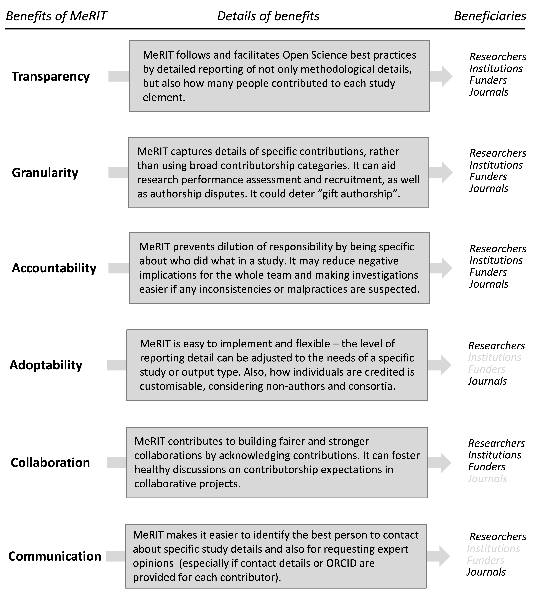

<h2>The Benefits of MeRIT</h2>
 <h3>Below you will see a diagram illustrating the relative benefits of MeRIT (Method Reporting with Initials for Transparency):</h3>
      
  

       

  
 
 

<h3>In addition, why not try this shiny App which interactively describes the above figure. </h3>  
 
 

  

<iframe src = "https://edivimeycook.shinyapps.io/MeRIT_DNA/" style = "border:none; width:500px; height:1000px;"></iframe

