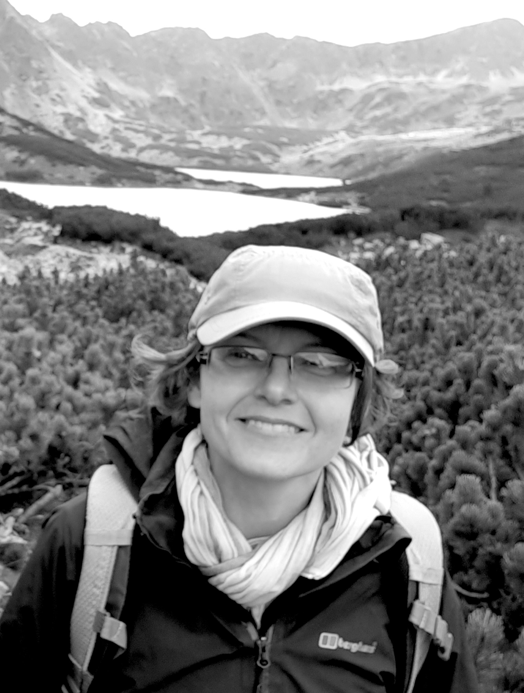
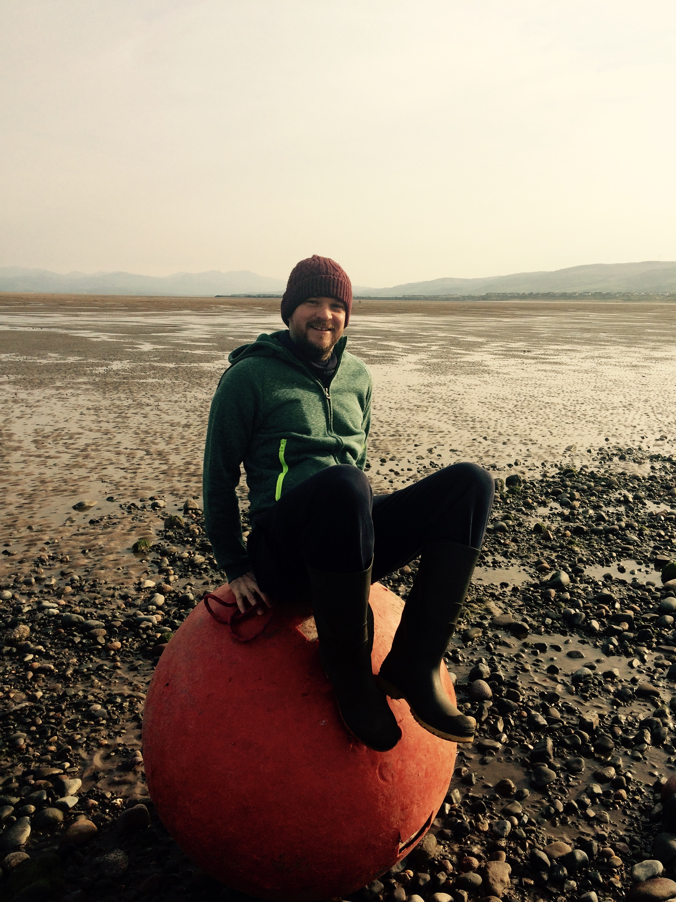
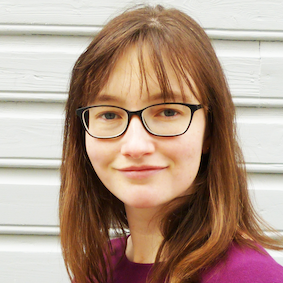
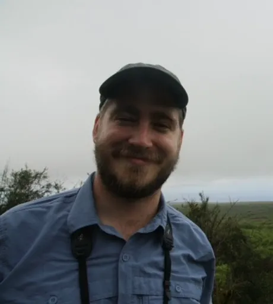
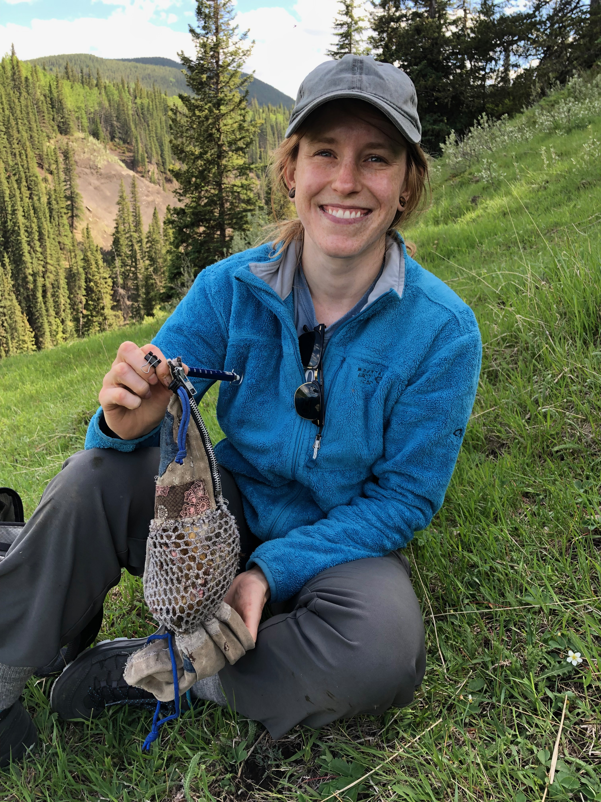
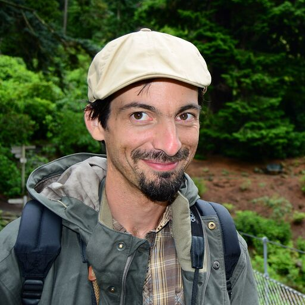
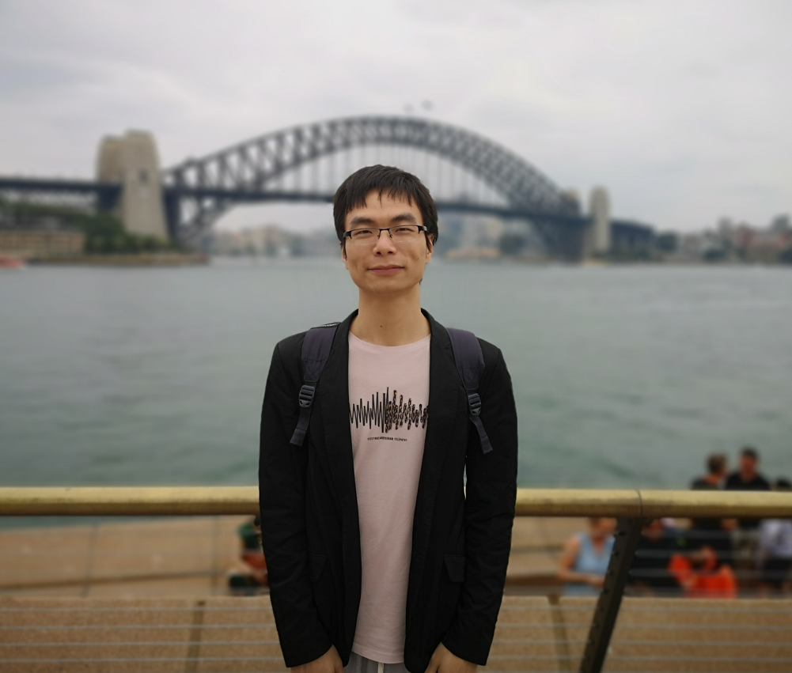
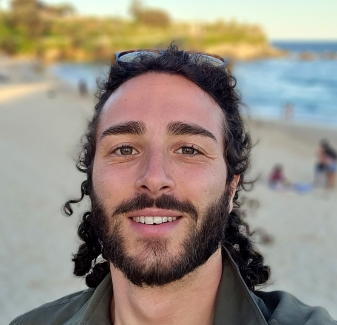
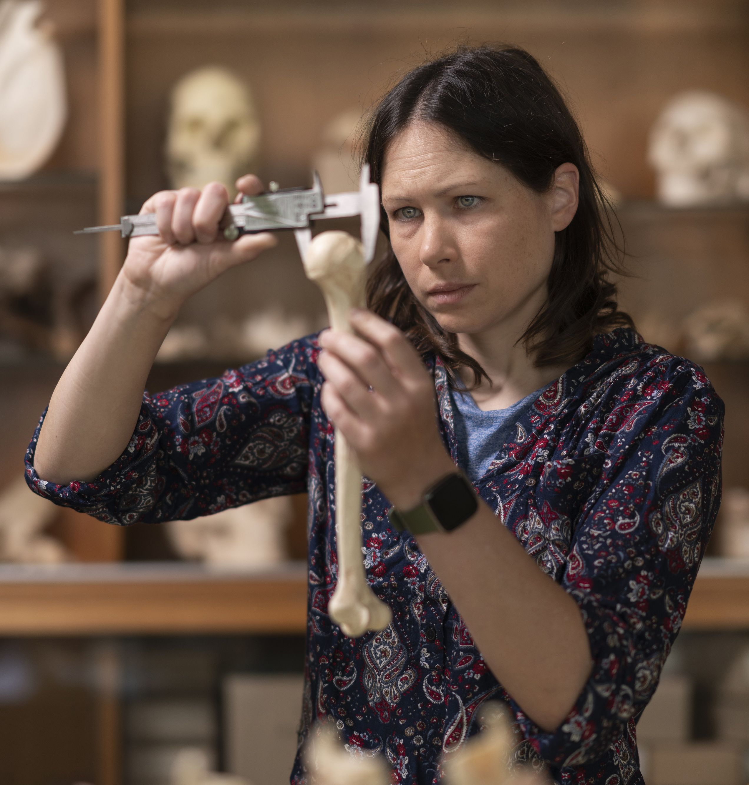

<h2>The MeRIT Core Team</h2>

||||
|:-:|:-:|:-:|
|   <a href="http://www.i-deel.org/">Shinichi Nakagawa</a> |  <a href="www.mlagisz.weebly.com">Malgorzata (Losia) Lagisz</a>  |   <a href="https://eivimeycook.github.io/">Ed Ivimey-Cook</a> |
|   Matt Grainger |   Rose O'Dea |

  

<h2>The MeRIT Investigation Team</h2>

||||
|:-:|:-:|:-:|
|   Joel Pick |    <a href="martinig.weebly.com">April Martinig</a>  |   Saras Windecker |
|   Matthieu Paquet |   Yefeng Yang |   Coralie Williams | 
|   Szymon Drobniak |   Samantha Burke |   <a href="https://www.livingpfas.org/about_team.html">Lorenzo Ricolfi</a> |
|   <a href="patricepottier.owlstown.net">Patrice Pottier</a>  |   Erin Macartney |   Kyle Morrison | 
|   Laura Wilson |   David Wilkinson |

